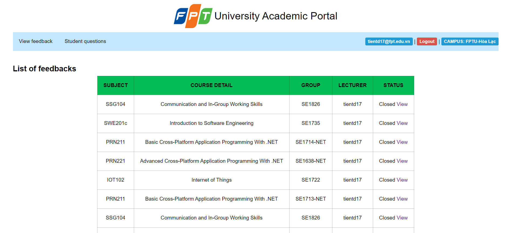
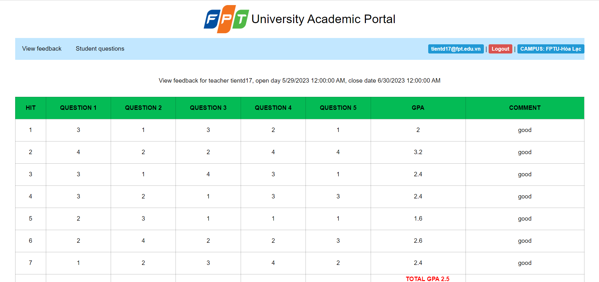
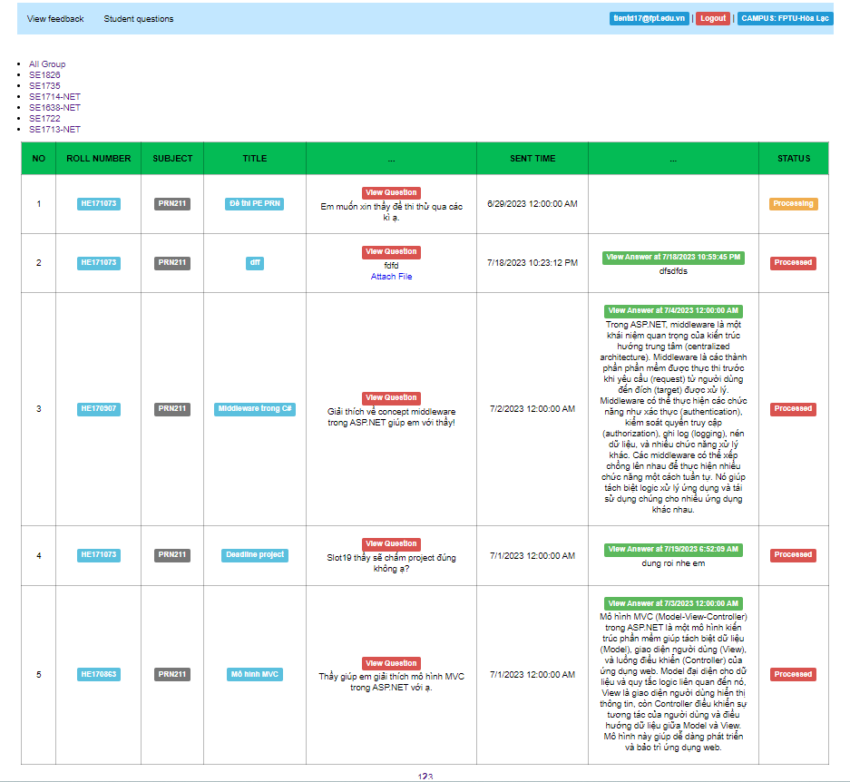
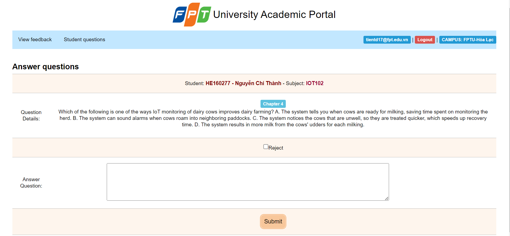
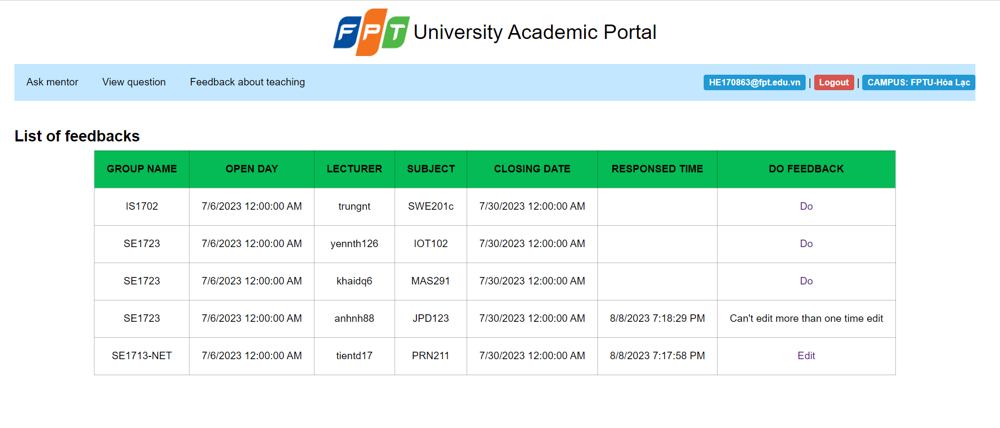
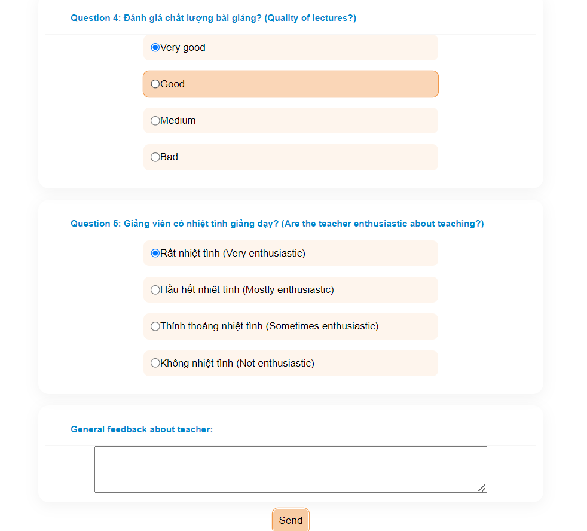
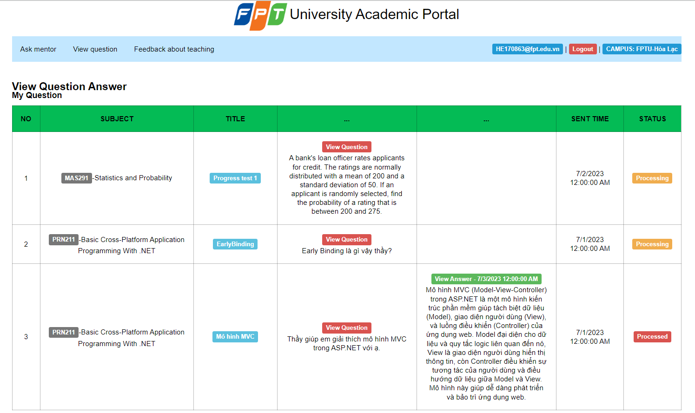
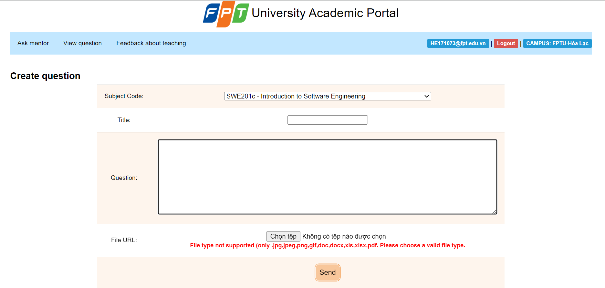

## 1. Detailed Specification

This is an individual assignment of PRN211\
You are asked to provide a web application for *Feedback and Question&Answer System* at FPT University\
(Reconstructing FAP).\
You can base on existing sources to develop your design including: fap.fpt.edu.vn, flm.fpt.edu.vn, ...

### Login for student and lecturer 

## Lecturer account
### List Feedback of lecturer

### Lecturer view GPA feedback of each class   

### Lecturer views questions of the teaching classes  

### Lectuter answers question  

## Student account
### Doing Feedbacks of student 

### Student responses feedback for lecturer of the class  

### Students view questions and answers of their studying class    

### Student sends question to lecturer   

## 2. Tool
* Backend: C# with ASP.NET Core
* Frontend: HTML CSS JS
* Database: SQL Server

#### FPTU Semester SUMMER 2023 © mai.phương.hoàng |

