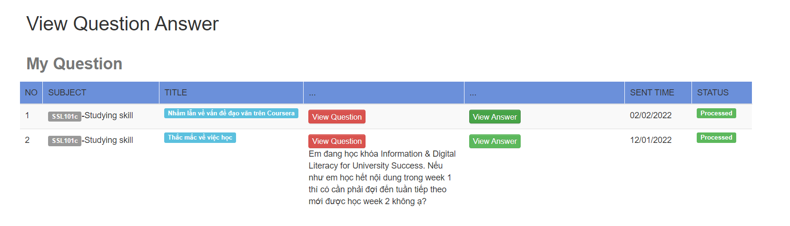

### Create Question - Process

### Create Question - Message for question content input

### Create Question - Message for subject input

### Create Question - Successfully 

### View Question - Answer is rocessing 

### View Question - Answer is processed

